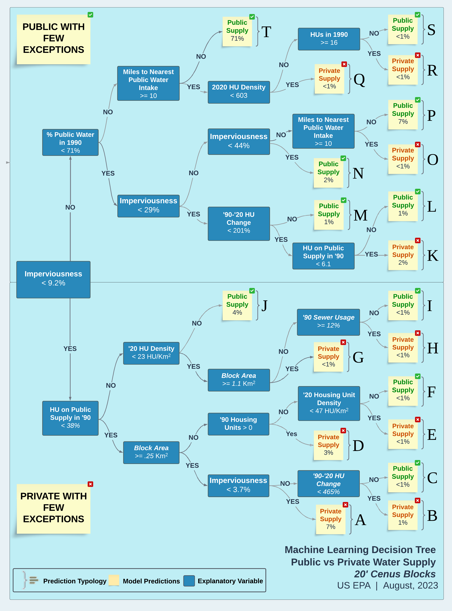

## Dataset of Census Blocks

The 'Well_Estimates_2020.csv' dataset represents the final estimates of well use by housing units at the census block geography. The number of housing units using public water systems may be inferred by subtracting `Est_Wells_2020` from `HU_2020`. Column descriptions can be found in the table below.

| Column | Description |
|----|----|
| GEOID_Blk | U.S. Census block identifier |
| GEOID_BlkGrp | U.S. Census block group identifier |
| State | State name |
| HU_2020 | Count of housing units in 2020 |
| PctSwr90 | Percent of housing units with sewer hookups in 1990 |
| Pct_Imprv | Percent of block that is impervious surface |
| Prob_Pub | Probability that the census block is connected to a public water system as returned by the decision tree. |
| Tree_Cat | The letter corresponding to the end node of the decision tree that the block was classified into. Refer to the figure of the decision tree (below). |
| Pred_Class | The classification of the census block as public or private. |
| wasIsland | Denotes if a census block was reclassified based on it being originally classified opposite of all neighboring blocks. |
| NA_Reclass | Denotes if a census block was classified based on surrounding blocks due to lack of data. |
| Est_Wells_2020 | Estimated count of housing units using private water supply sources within the census block in 2020. |

Figure: Visualization of decision tree showing how census blocks are classified into twenty typologies, represented by letters 'A' through 'T'
